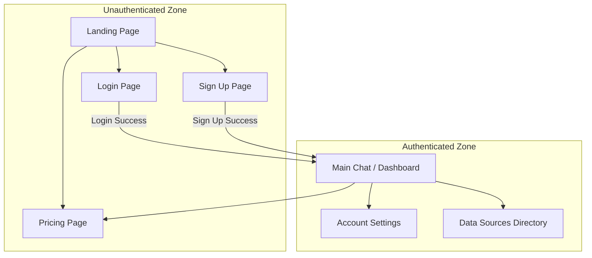
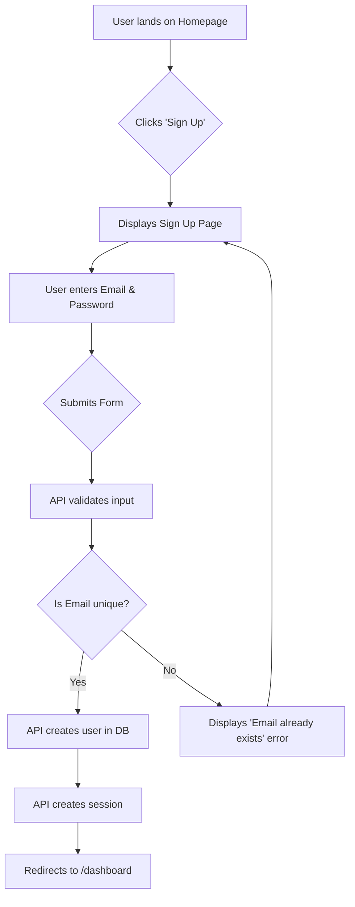
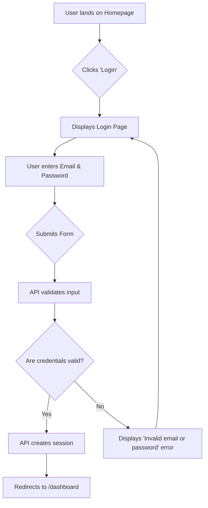
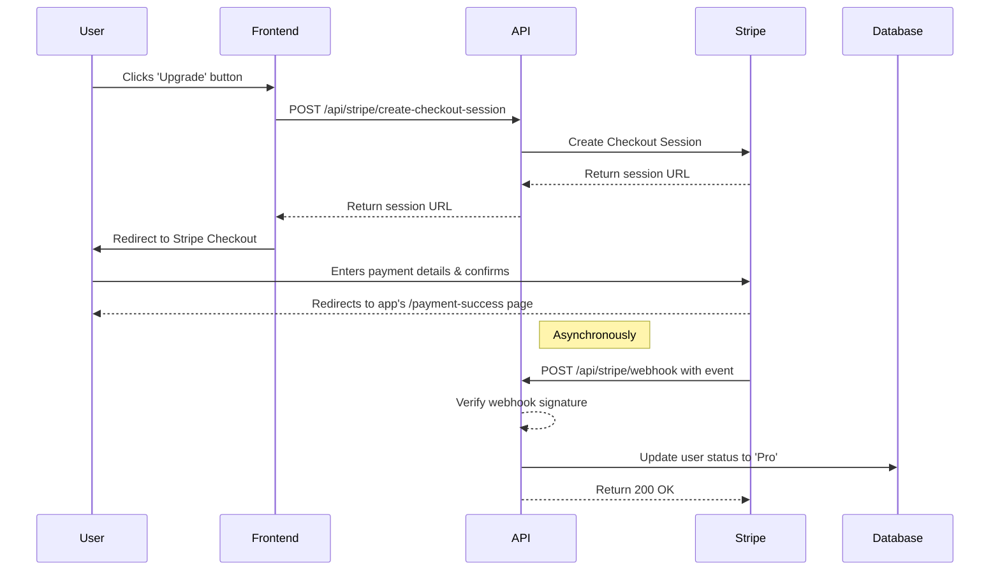

# UI/UX Specification: PriceControl

## 1. Introduction

This document defines the user experience goals, information architecture, user flows, and visual design specifications for PriceControl's user interface. It serves as the foundation for visual design and frontend development, ensuring a cohesive and user-centered experience.

### Overall UX Goals & Principles

* **Target User Personas:**
    * **Primary: The Professional/Prosumer Analyst:** Needs a data-dense, efficient, and transparent interface.
    * **Secondary: The Sophisticated Retail Investor:** Needs a clean, trustworthy, and easy-to-navigate experience.
* **Usability Goals:**
    * **Clarity:** Users must be able to understand data and its sources at a glance.
    * **Efficiency:** The interface should minimize clicks and allow for rapid querying and analysis.
    * **Trust:** The design must feel professional and secure, reinforcing the reliability of the data.
* **Design Principles:**
    * **Clarity over cleverness:** Prioritize clear communication over aesthetic innovation.
    * **Progressive disclosure:** Show only what's needed, when it's needed, to avoid overwhelming the user.
    * **Consistent patterns:** Use familiar UI patterns throughout the application to reduce cognitive load.
    * **Accessible by default:** Design for all users from the start, adhering to WCAG AA standards.

### Key Interaction Paradigms

* **Conversational Interface:** The primary interaction will be a text-based chat with the LLM.
* **Guided Prompting:** Offer users a set of pre-defined starter prompts (as buttons) to guide their discovery and demonstrate the LLM's capabilities, especially for new users.
* **Model Selection:** Users will have a clear and simple way to switch between "Instruct" and "Thinking" LLM variants.
* **Data Visualization:** Financial data (e.g., stock prices) will be presented in clear, interactive charts.
* **Source Transparency:** Users should be able to easily see which data source was used for a given response.

---

## 2. Information Architecture (IA)

### Site Map / Screen Inventory
This diagram shows the primary screens of the application and how they relate to one another.



### Navigation Structure

* **Primary Navigation:** Once a user is logged in, the main navigation bar will contain links to:
    * **Chat:** The primary dashboard interface.
    * **Data Sources:** The directory of approved sources.
    * **Pricing:** To view plans and upgrade.
    * **Account:** A dropdown menu with links to "Settings" and "Logout".
* **Breadcrumb Strategy:** A breadcrumb strategy is likely unnecessary for the MVP's relatively flat architecture but can be considered post-MVP if more deeply nested pages are added.

---

## 3. User Flows

### User Onboarding (Sign Up)

* **User Goal:** A new user wants to create an account to access the application.
* **Entry Points:** From the Landing Page or Pricing Page, clicking a "Sign Up" or "Get Started" button.
* **Success Criteria:** The user successfully creates an account, is logged in, and is redirected to the Main Chat / Dashboard.

#### Flow Diagram


#### Edge Cases & Error Handling:
* User provides an email in an invalid format.
* User provides a password that doesn't meet security requirements (e.g., too short).
* User's email already exists in the system.
* A network error occurs during form submission.

---

### User Authentication (Login)

* **User Goal:** An existing user wants to log in to access their account.
* **Entry Points:** From the Landing Page or Pricing Page, clicking a "Login" or "Sign In" button.
* **Success Criteria:** The user successfully authenticates, a session is created, and they are redirected to the Main Chat / Dashboard.

#### Flow Diagram


#### Edge Cases & Error Handling:
* User enters the correct email but the wrong password.
* User enters an email address that is not registered.
* The login form should be protected against brute-force attacks (e.g., with rate-limiting).
* A network error occurs during form submission.
* **Note:** The error message should be generic ("Invalid email or password") to avoid confirming whether an email address is registered.

---

### Core Product Interaction (Ask a Question)

* **User Goal:** A logged-in user wants to ask the financial assistant a question and receive a trustworthy, sourced answer.
* **Entry Points:** The Main Chat / Dashboard, which is the default page after login.
* **Success Criteria:** The user receives a helpful, accurate, and streaming response to their query, which includes a citation to the approved data source that was used.

#### Flow Diagram
```mermaid
sequenceDiagram
    participant User
    participant Frontend
    participant API (/api/ai)
    participant LLM Service (vLLM)
    participant Governed Tool (e.g., web.fetch)

    User->>Frontend: Types and sends query
    Frontend->>API: POST /api/ai with messages
    API->>LLM Service: streamText(query, tools)
    LLM Service->>API: Decides to use tool
    API->>Governed Tool: execute(tool_parameters)
    Governed Tool-->>Governed Tool: Validate source against allow-list
    alt Source is Allowed
        Governed Tool->>Internet: Fetch data
        Internet-->>Governed Tool: Return data
        Governed Tool-->>API: Return formatted data
        API->>LLM Service: Provide tool output
        LLM Service->>API: Stream synthesized answer + citation
        API-->>Frontend: Stream response chunks
        Frontend-->>User: Display streaming answer & citation
    else Source is Not Allowed
        Governed Tool-->>API: Return error
        API->>LLM Service: Provide error output
        LLM Service->>API: Stream refusal message
        API-->>Frontend: Stream response chunks
        Frontend-->>User: Display message explaining source is not allowed
    end
```

#### Edge Cases & Error Handling:
* The external data source API is down or returns an error.
* The user's query is ambiguous and the LLM cannot determine which tool to use.
* The streaming connection is interrupted mid-response.
* The LLM provides an answer but fails to correctly cite the source.

---

### Subscription Upgrade

* **User Goal:** A free user wants to upgrade to a paid 'Pro' plan to unlock premium features or remove usage limits.
* **Entry Points:** From the `/pricing` page, or from an in-app prompt shown after hitting a usage limit.
* **Success Criteria:** The user successfully completes the payment via Stripe Checkout, their account status is updated to 'Pro' in the database, and they are redirected back to the application with premium access.

#### Flow Diagram


#### Edge Cases & Error Handling:
* The user's payment is declined.
* The user abandons the checkout process and returns to the app.
* The Stripe webhook is delayed or fails. The system must have a way to reconcile the user's status.
* A network error occurs while creating the checkout session.

---

## 4. Wireframes & Mockups

The primary design tool for creating high-fidelity mockups will be Figma. The initial layout and structure were conceptualized in the following text-based wireframe, which can be used to generate a prototype with an AI UI tool like Vercel's v0.

### Text-Based Wireframe: Main Chat Interface

* **Overall Layout:** A three-panel layout. A fixed left sidebar for chat history, a main content area for the current conversation, and a header.
* **Header:**
    * **Left:** The application name/logo ("PriceControl").
    * **Center:** The **Dual Model Selector**, a simple toggle or segmented control allowing the user to switch between "Instruct" and "Thinking" modes.
    * **Right:** A user avatar with a dropdown menu for "Account Settings" and "Logout."
* **Left Sidebar (Chat History):**
    * A scrollable list of previous conversations.
    * Each item in the list shows a short, auto-generated title (e.g., "SEC Filings for TSLA").
    * A "New Chat" button is fixed at the top.
* **Main Content (Conversation Area):**
    * **Message Display:** A scrollable area taking up most of the vertical space. User messages are aligned to the right, and AI responses are aligned to the left. AI responses that use a data source **must** include a small, clickable citation link (e.g., "") below the message.
    * **Input Form:** Fixed at the bottom of the screen. It contains a multi-line text area, a "Send" button, and a row of **Starter Prompt Buttons**.

---

## 5. Component Library / Design System

### Design System Approach
We will use **shadcn/ui**, a composable component library built on Tailwind CSS and Radix UI primitives. This allows for rapid development of a consistent, accessible UI.

### Core Components
* **Button:** For all interactive actions (primary, secondary, link variants).
* **Textarea:** For the main chat input, configured to auto-resize.
* **Avatar:** To display the user's icon in the header.
* **Dropdown Menu:** For the user account menu.
* **Toggle Group:** To handle model selection.
* **Scroll Area:** For the chat history and message display.

---

## 6. Branding & Style Guide

### Visual Identity
* **Brand Guidelines:** This document serves as the initial style guide. The direction is minimalist, professional, and optimized for data clarity in a dark-theme environment.

### Color Palette

| Color Type | Hex Code    | Usage                                     |
| :---       | :---        | :---                                      |
| Primary    | `#3b82f6`   | Interactive elements: buttons, links, focus rings |
| Secondary  | `#64748b`   | Secondary buttons, subtle borders         |
| Success    | `#22c55e`   | Positive feedback, confirmation messages  |
| Warning    | `#f59e0b`   | Cautions, important notices               |
| Error      | `#ef4444`   | Errors, destructive action confirmations  |
| Neutral    | `#09090b` to `#fafafa` | Text, borders, and tiered background colors (using the `zinc` palette) |

### Typography

* **Font Families:**
    * **Primary:** `Inter` (A clean, highly readable sans-serif font).
    * **Monospace:** `Fira Code` (For numerical data or code snippets).
* **Type Scale:** Standard scale from H1 (`2.25rem`, bold) to Body (`1rem`, regular) and Small (`0.875rem`, regular).

### Iconography
* **Icon Library:** We will use **`lucide-react`** for all icons, as it is the default for `shadcn/ui`.

### Spacing & Layout
* **Grid System:** The layout will be managed using Tailwind CSS's built-in responsive flexbox and grid utilities.
* **Spacing Scale:** All margins, padding, and gaps will use Tailwind's default 4px-based spacing scale for visual consistency.

---

## 7. Accessibility Requirements

### Compliance Target
* **Standard:** The application will target compliance with the **Web Content Accessibility Guidelines (WCAG) 2.1 at Level AA**.

### Key Requirements
* **Visual:** All text must meet a 4.5:1 contrast ratio; all interactive elements must have a visible focus state.
* **Interaction:** All functionality must be operable via keyboard, and the application must be compatible with screen readers.
* **Content:** All images must have alt text, pages must use a logical heading structure, and form inputs must have labels.

### Testing Strategy
* A combination of automated testing with tools like `axe-core` and manual keyboard/screen reader testing for critical user flows.

---

## 8. Responsiveness Strategy

### Breakpoints
| Breakpoint | Min Width | Target Devices        |
| :---       | :---      | :---                  |
| Mobile     | 0px       | Phones                |
| Tablet     | 768px     | Tablets, small laptops|
| Desktop    | 1024px    | Laptops, desktops     |

### Adaptation Patterns
* **Mobile:** The left sidebar will be hidden by default and accessible via a hamburger menu icon.
* **Tablet:** The sidebar may be rendered as a condensed, icon-only bar.
* **Desktop:** The full three-panel layout will be visible.

---

## 9. Animation & Micro-interactions

### Motion Principles
* **Purposeful, Not Decorative:** Animations will be used to guide attention and provide feedback.
* **Subtle and Professional:** Motion will be quick and simple (fades/slides).
* **Accessible:** The system will respect the `prefers-reduced-motion` browser setting.

### Key Animations
* Smooth fade/slide transitions for UI elements like dropdowns.
* Subtle feedback on interactive elements for hover and click states.
* Skeleton loaders for content areas to manage perceived performance.
* Fluid fade-in for streaming AI responses.

---

## 10. Performance Considerations

### Performance Goals
* **Page Load:** Target a Largest Contentful Paint (LCP) of under 2.5 seconds.
* **Interaction Response:** Provide feedback in under 100ms.
* **Animation FPS:** Maintain a steady 60 frames per second (fps).

### Design Strategies
* Employ skeleton loaders, code splitting, and lazy loading.
* Optimize all assets and leverage Vercel's Edge Network for caching.
* Pre-warm data caches before peak market hours.

---

## 11. Next Steps

### Immediate Actions
1.  Review and approve this final UI/UX Specification document.
2.  Handoff this document and the PRD to the Architect (Winston) to begin creating the detailed Fullstack Architecture.
3.  Begin creating high-fidelity mockups in a design tool like Figma based on the wireframes and style guide defined in this document.

### Design Handoff Checklist
* [x] All user flows documented
* [x] Component inventory complete
* [x] Accessibility requirements defined
* [x] Responsive strategy clear
* [x] Brand guidelines incorporated
* [x] Performance goals established