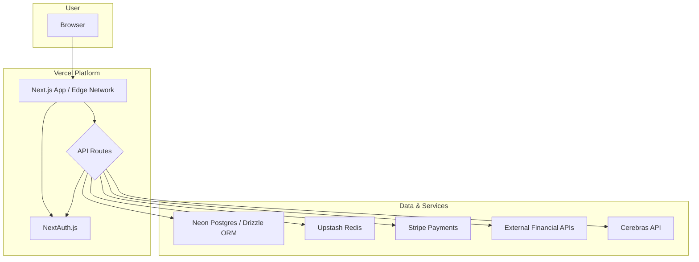

# 2. High-Level Architecture

## Technical Summary
The architecture for PriceControl will be a full-stack, type-safe web application built upon the T3 Stack foundation. It will feature a Next.js frontend with serverless API routes deployed on Vercel, a Neon serverless Postgres database with Drizzle ORM for data persistence, and NextAuth.js for authentication. This cohesive stack is designed for rapid development, scalability, and end-to-end type safety, directly supporting the project's goal of delivering a reliable financial analysis tool.

## Platform and Infrastructure Choice
* **Platform:** Vercel
* **Key Services:** Vercel Functions, Neon (Postgres), Upstash (Redis), Stripe (Payments), and Cerebras for the LLM service.
* **Deployment Regions:** US-East for primary compute and database services, with global distribution for static assets via Vercel's Edge Network.

## Repository Structure
* **Structure:** Monorepo
* **Monorepo Tool:** The T3 Stack provides a standard monorepo structure managed via npm/pnpm workspaces.

## High Level Architecture Diagram

## Architectural Patterns
* **Full-stack Type Safety:** Leveraging Zod and TypeScript to ensure type safety from the database schema (Drizzle) through the API layer to the frontend (React).
* **Serverless Functions:** Using Next.js API Routes deployed as serverless functions on Vercel for all backend logic.
* **Component-Based UI:** Using React Server Components (RSC) within the Next.js App Router for an efficient and modern frontend.
* **Repository Pattern (via ORM):** Abstracting data access through Drizzle ORM, creating a clean separation between business logic and data persistence.

---
