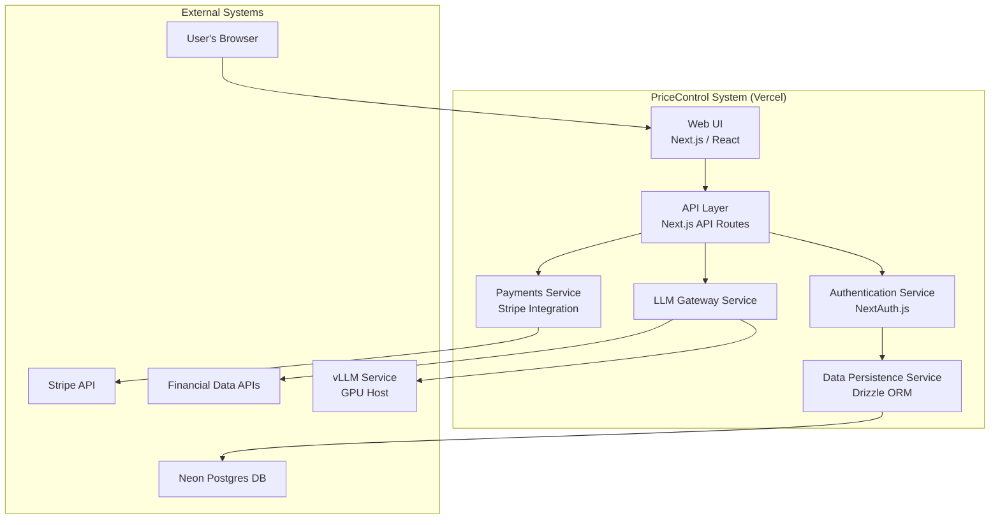

# 6. Components

## Component Diagram

## Component List

### Web UI (Next.js Frontend)
* **Responsibility:** To render the entire user interface, manage all client-side state (e.g., chat history, UI state), and serve as the primary entry point for all user interactions. It is responsible for making secure, authenticated requests to the API Layer for all business logic.
* **Key Interfaces:** Exposes a responsive web interface to the user's browser. It consumes the RESTful API defined in the API Specification.
* **Dependencies:** It is highly dependent on the API Layer for all data, authentication, and AI functionality.
* **Technology Stack:** Next.js `~14.2`, React, TypeScript, Tailwind CSS, shadcn/ui, Zustand.

### API Layer (Next.js API Routes)
* **Responsibility:** To act as the secure backend-for-frontend (BFF). Its primary responsibility is to receive requests from the Web UI, orchestrate the necessary business logic by calling other internal services (like Auth, Payments, LLM), and return data in a format the frontend can easily consume.
* **Key Interfaces:** Exposes the RESTful API defined in the OpenAPI Specification. It provides the endpoints for all application functionality.
* **Dependencies:** Depends on the Authentication Service, Data Persistence Service, LLM Gateway Service, and Payments Service to fulfill requests.
* **Technology Stack:** Next.js `~14.2` API Routes, TypeScript, Zod (for request validation).

### Authentication Service (NextAuth.js)
* **Responsibility:** To handle all aspects of user authentication and session management. Its sole responsibility is to verify user identities, create and manage secure sessions (e.g., via cookies), and provide the API Layer with the mechanisms to protect endpoints.
* **Key Interfaces:** Exposes middleware and helper functions used by the API Layer to protect routes. It also provides both the client and server components with the current user's session state.
* **Dependencies:** Depends on the Data Persistence Service to retrieve and verify user credentials.
* **Technology Stack:** NextAuth.js `~5.0`.

### Data Persistence Service (Drizzle + Neon)
* **Responsibility:** To manage all interactions with the Neon Postgres database. It is responsible for executing queries, managing schema migrations, and providing a type-safe data access layer for other services. It ensures the application's business logic is decoupled from the raw database implementation.
* **Key Interfaces:** Exposes a set of type-safe functions and objects via Drizzle ORM for creating, reading, updating, and deleting data. It is consumed by any service that needs to interact with the database.
* **Dependencies:** Depends directly on the Neon Postgres database service.
* **Technology Stack:** Drizzle ORM `~0.30`, Neon Serverless Driver, Postgres `16`.

### LLM Gateway Service
* **Responsibility:** To serve as the dedicated and secure interface between our application and the external vLLM service. It is responsible for loading system prompts, constructing the final request to the LLM, defining and providing the available tools, and most critically, enforcing the data source governance by validating all tool calls against the `/datasources.yml` allow-list.
* **Key Interfaces:** Exposes a primary function to the API Layer that takes the conversation context (messages, selected model) and returns a readable stream of the AI's response.
* **Dependencies:** Depends on the external vLLM Service for text generation and the Data Persistence Service to create an audit log of all tool calls.
* **Technology Stack:** TypeScript, Vercel AI SDK, Zod (for tool parameter validation).

### Payments Service (Stripe Integration)
* **Responsibility:** To handle all interactions related to billing and subscriptions. It is responsible for creating Stripe Checkout sessions for new subscriptions and processing incoming webhooks from Stripe to update a user's subscription status in our database.
* **Key Interfaces:** Exposes an internal API consumed by the main API Layer to initiate payments. It also exposes a public webhook endpoint to receive events directly from the Stripe API.
* **Dependencies:** Depends on the external Stripe API for all payment processing and on the Data Persistence Service to update the `User` model with subscription changes.
* **Technology Stack:** Stripe Node.js library, Next.js API Routes.

---
