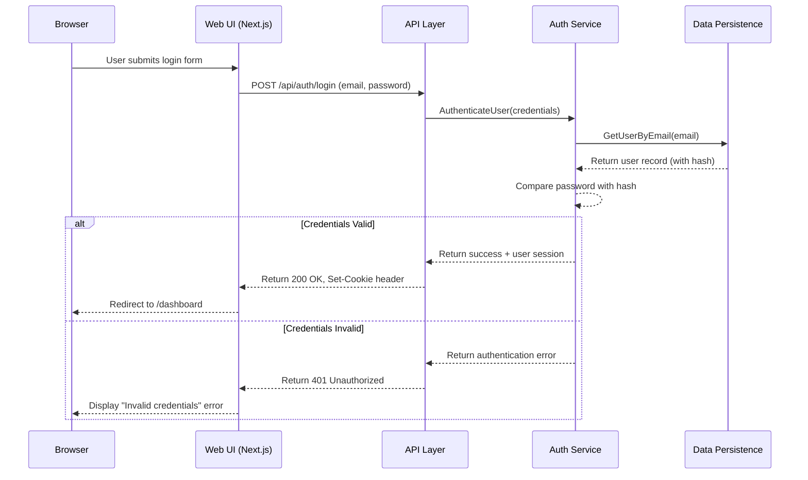
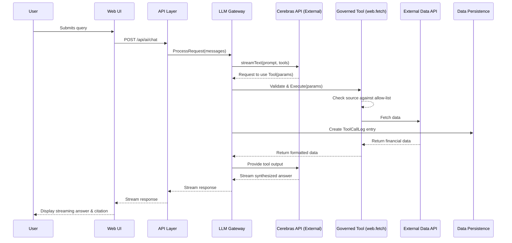

# 8. Core Workflows

## User Login Flow

```mermaid
sequenceDiagram
    participant Browser
    participant WebUI as Web UI (Next.js)
    participant APILayer as API Layer
    participant AuthService as Auth Service
    participant DataService as Data Persistence

    Browser->>WebUI: User submits login form
    WebUI->>APILayer: POST /api/auth/login (email, password)
    APILayer->>AuthService: AuthenticateUser(credentials)
    AuthService->>DataService: GetUserByEmail(email)
    DataService-->>AuthService: Return user record (with hash)
    AuthService-->>AuthService: Compare password with hash
    alt Credentials Valid
        AuthService-->>APILayer: Return success + user session
        APILayer-->>WebUI: Return 200 OK, Set-Cookie header
        WebUI-->>Browser: Redirect to /dashboard
    else Credentials Invalid
        AuthService-->>APILayer: Return authentication error
        APILayer-->>WebUI: Return 401 Unauthorized
        WebUI-->>Browser: Display "Invalid credentials" error
    end
```

## AI Chat Query with Tool Use

```mermaid
sequenceDiagram
    participant User
    participant WebUI as Web UI
    participant APILayer as API Layer
    participant LLMGateway as LLM Gateway
    participant Cerebras as Cerebras API (External)
    participant Tool as Governed Tool (web.fetch)
    participant DataAPI as External Data API
    participant AuditLog as Data Persistence

    User->>WebUI: Submits query
    WebUI->>APILayer: POST /api/ai/chat
    APILayer->>LLMGateway: ProcessRequest(messages)
    LLMGateway->>Cerebras: streamText(prompt, tools)
    Cerebras-->>LLMGateway: Request to use Tool(params)
    LLMGateway->>Tool: Validate & Execute(params)
    Tool-->>Tool: Check source against allow-list
    Tool->>DataAPI: Fetch data
    LLMGateway->>AuditLog: Create ToolCallLog entry
    DataAPI-->>Tool: Return financial data
    Tool-->>LLMGateway: Return formatted data
    LLMGateway->>Cerebras: Provide tool output
    Cerebras-->>LLMGateway: Stream synthesized answer
    LLMGateway-->>APILayer: Stream response
    APILayer-->>WebUI: Stream response
    WebUI-->>User: Display streaming answer & citation
```

---
