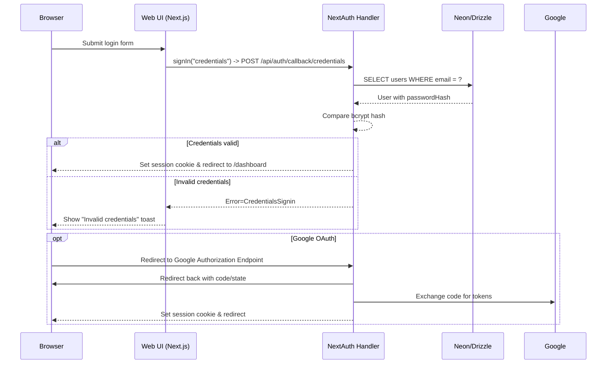
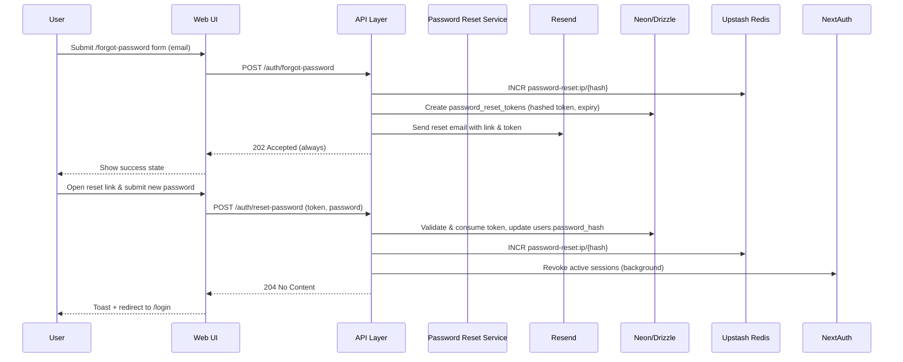
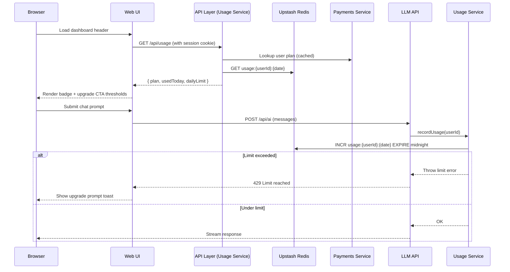
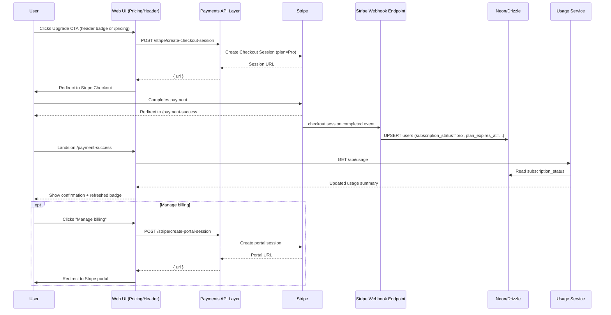
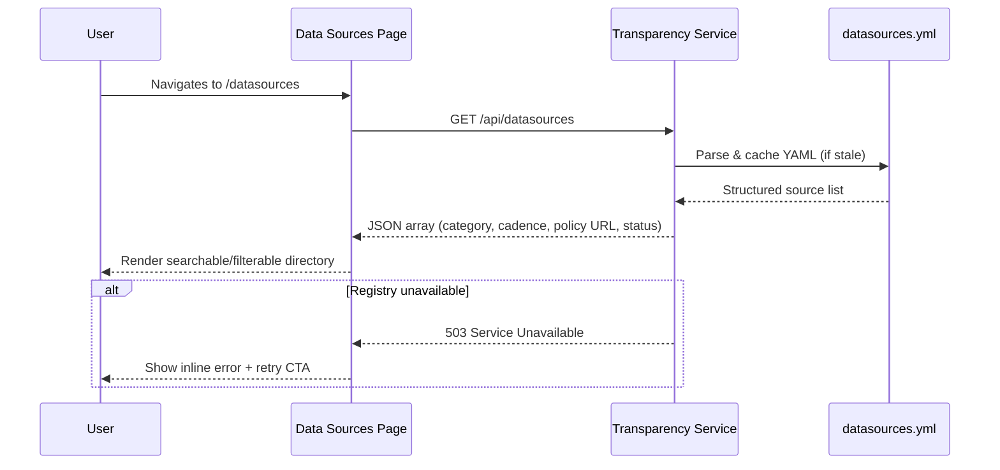
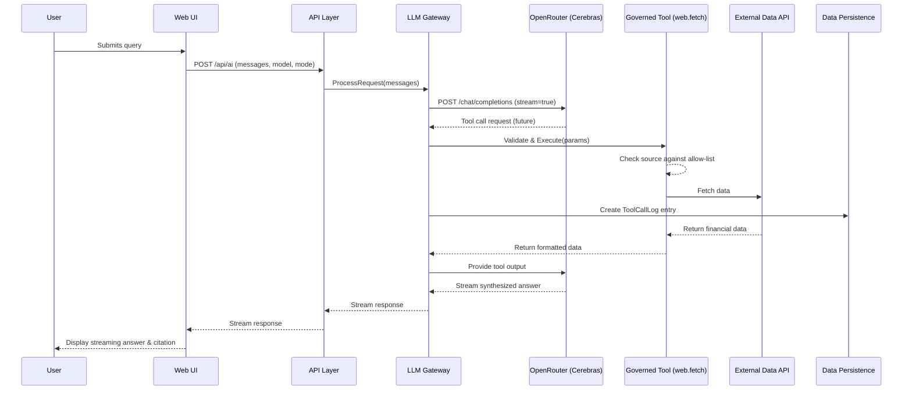
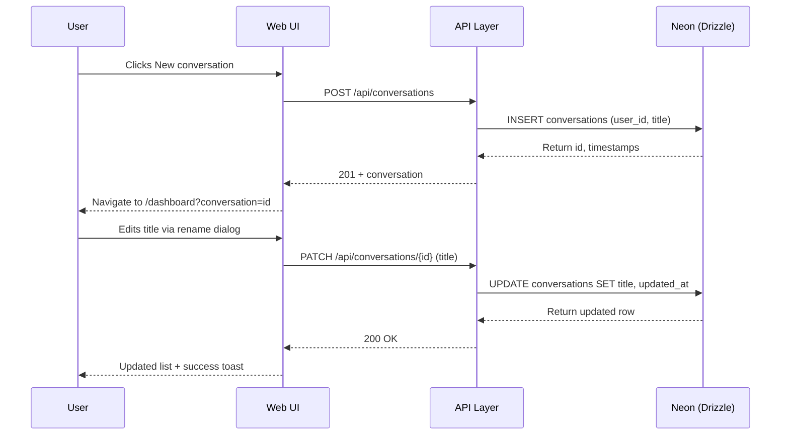

# 8. Core Workflows

## User Login Flow

*The login page conditionally displays the Google button by calling `GET /api/auth/providers`. Both flows use the same NextAuth handler, ensuring consistent session issuance.*

## Password Reset Flow

## Usage Summary Fetch & Freemium Gating

## Stripe Upgrade & Payment Success Loop

## Data Sources Directory Rendering

## AI Chat Query with Tool Use (OpenRouter -> Cerebras)

## Conversation Management (Create / Switch / Rename)

---
